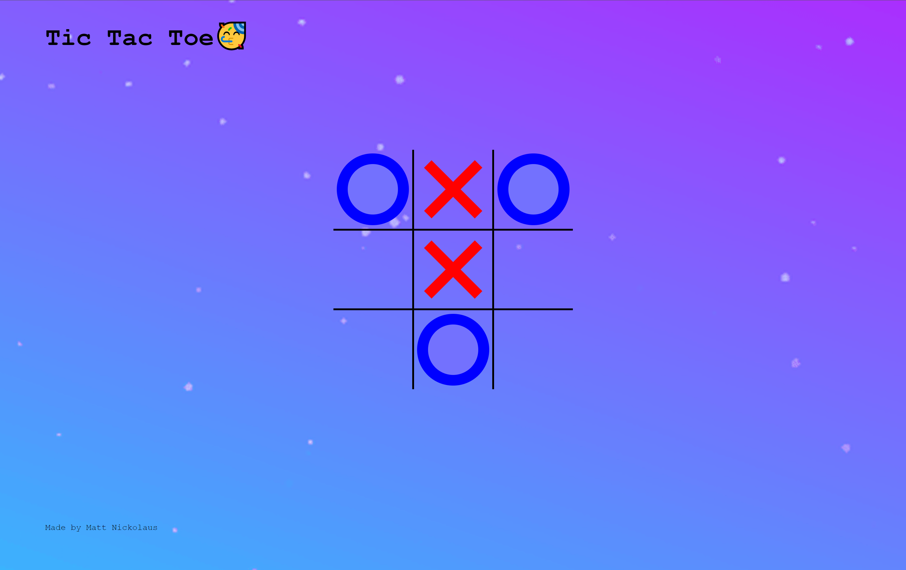
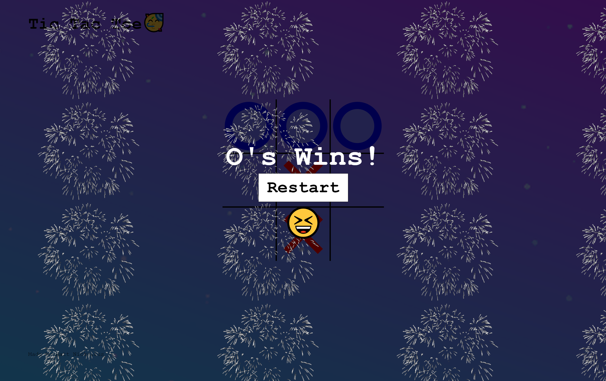

# TicTacToe Game

In this project I completed a TicTacToe game that uses fairly simple JavaScript logic and some interesting CSS to create the elements of the game. The board itself is created by 9 data cells and the X's and O's by using the before and after pseudo classes to create their shapes depending on the current users turn. I similarly created a hover effect that displays the grayed out O or X on the hovered tile by setting the board's hover class after a turn is taken.

When one of the conditions of winning the game occurs or the board is filled meaning the game is a draw, a winning message appears on screen with a button to restart the game.

### Skills Used

1. **JavaScript Fundamentals**: Understanding of basic JavaScript syntax, data types, variables, functions, loops, and conditionals is essential.
2. **DOM Manipulation**: Ability to manipulate HTML elements using JavaScript, updating the game board dynamically.
3. **Event Handling**: Knowledge of handling user interactions such as clicks on game cells or buttons.
4. **HTML/CSS**: Basic understanding of HTML structure and CSS styling to create the game layout and appearance.
5. **Conditional Statements**: Utilizing conditional statements to check for winning conditions and game over scenarios.
6. **Arrays and Data Structures**: Using arrays to represent the game board and storing game state data.
7. **Functions and Scope**: Organizing code into reusable functions and managing variable scope.
8. **Algorithmic Thinking**: Implementing algorithms to check for winning combinations and decide computer player moves (if applicable).
9. **User Interface Design**: Designing an intuitive user interface for the game, including feedback for user actions and displaying game status.
10. **Debugging**: Ability to identify and fix errors in the code using browser developer tools or debugging techniques.
11. **Version Control**: Optionally, using version control systems like Git to manage code changes and collaborate with others.
12. **Testing**: Writing and executing tests to ensure the game functions correctly under various conditions.
13. **Responsive Design**: Optionally, implementing responsive design principles to make the game playable on different devices and screen sizes.
14. **Game Logic**: Implementing the game logic, including player turns, checking for win conditions, and handling ties.
